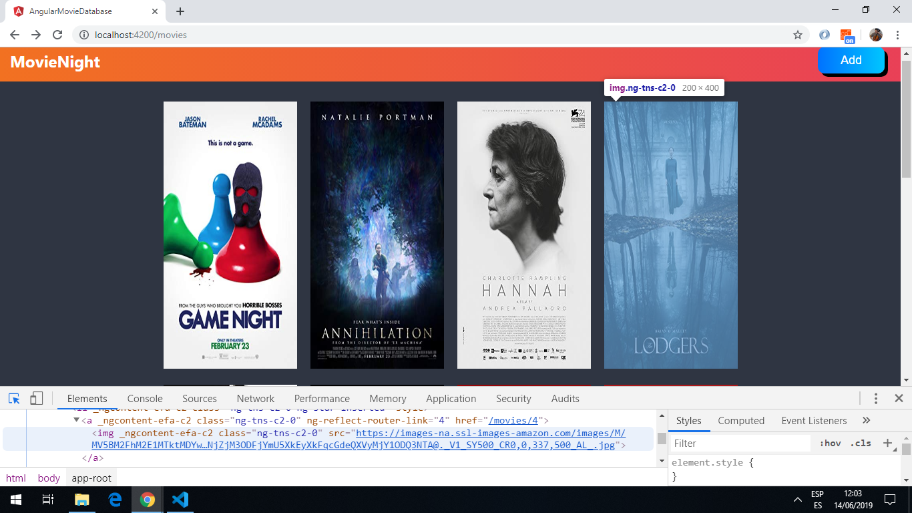
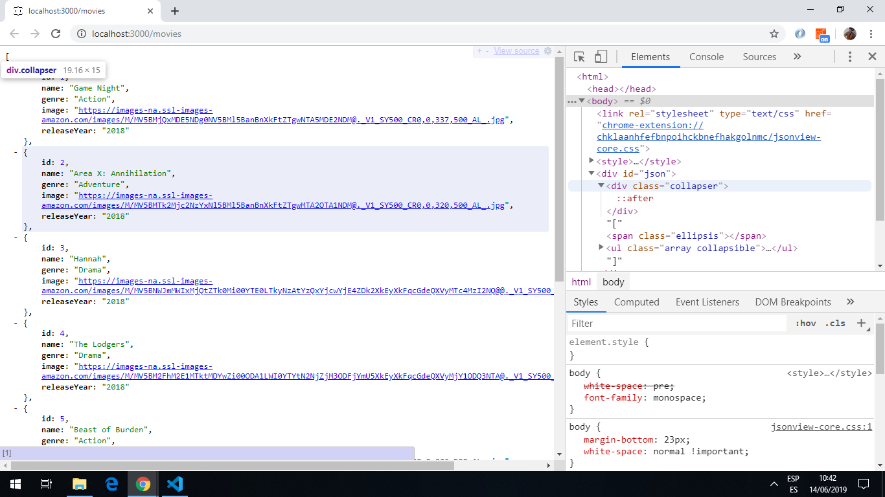
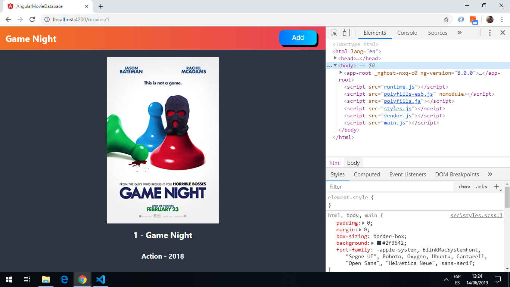

# :zap: Angular Movie Database

* App using Angular to create a movie database. The home screen displays a list of movie images. Each image redirects to a movie detail page with movie details listed using data-binding.
* Tutorial code from [Paul Halliday](https://www.youtube.com/channel/UCYJ9O6X1oFt7YGXpfRwrcWg) see [:clap: Inspiration](#clap-inspiration) below. Updated to latest Angular version.
* **Note:** to open web links in a new window use: _ctrl+click on link_


## :page_facing_up: Table of contents

* [:zap: Angular Movie Database](#zap-angular-movie-database)
  * [:page_facing_up: Table of contents](#pagefacingup-table-of-contents)
  * [:books: General info](#books-general-info)
  * [:camera: Screenshots](#camera-screenshots)
  * [:signal_strength: Technologies](#signalstrength-technologies)
  * [:floppy_disk: Setup](#floppydisk-setup)
  * [:computer: Code Examples](#computer-code-examples)
  * [:cool: Features](#cool-features)
  * [:clipboard: Status & To-Do List](#clipboard-status--to-do-list)
  * [:clap: Inspiration](#clap-inspiration)
  * [:envelope: Contact](#envelope-contact)

## :books: General info

* App routing module to load movie home screen. Differential loading used with 2nd routing module.
* Movie-routing module for: list of movies (MovieListComponent), form to add movie (AddMovieComponent) and a movie detail page (MovieDetailComponent).
* Dummy backend used to store json movie data.

## :camera: Screenshots

.
.
.

## :signal_strength: Technologies

* [Angular v15](https://angular.io/)
* [RxJS Library v7](https://angular.io/guide/rx-library) used to [subscribe](http://reactivex.io/documentation/operators/subscribe.html) to the API data [observable](http://reactivex.io/documentation/observable.html).
* [json-server v0.17.1](https://www.npmjs.com/package/json-server) used with the `db.json` file to get a fake API.

## :floppy_disk: Setup

* Install dependencies using `npm i` then run `ng serve` for a dev server. No API key required.
* Navigate to `http://localhost:4200/`. The app does automatically reload if you change any of the source files.
* Open a second terminal and run `npm run api` for a local JSON server. Navigate to `http://localhost:3000/`. The json file will update if a movie is added from the front-end 'add movie' page.

## :computer: Code Examples

* `movie-list.component.html` extract showing HTML to load movies asynchronously with a loading image until they are shown.

```html
<!--if there are movies then show them in the DOM using Angular async pipe-->
<ul *ngIf="movies$ | async as movies; else loading" [@listAnimation]="movies">
  <li *ngFor="let movie of movies">
    <a [routerLink]="movie.id">
      
    </a>
  </li>
</ul>

<ng-template #loading>
  <ul [@listAnimation]="loadingMovies.length">
    <li
      *ngFor="let movie of loadingMovies"
      [@listAnimation]="loadingMovies.length"
    >
      
    </li>
  </ul>
</ng-template>
```

## :cool: Features

* [Angular Reactive Forms](https://angular.io/guide/reactive-forms) (model-driven forms) are used instead of the html template-driven method.
* BrowserAnimations used to add some animation to the movie details loading.
* Working backend on port 3000 was very easy to setup and run.

## :clipboard: Status & To-Do List

* Status: Working.
* To-Do: Add a nav back button on detail page.

## :clap: Inspiration

* [Paul Halliday Youtube video: FREE Angular 8 Course - Learn Angular 8, RxJS, HttpClient, Smart/Presentational Components](https://www.youtube.com/watch?v=OcwwahqeASw)

## :file_folder: License

* This project is licensed under the terms of the MIT license.

## :envelope: Contact

* Repo created by [ABateman](https://github.com/AndrewJBateman), email: gomezbateman@yahoo.com
